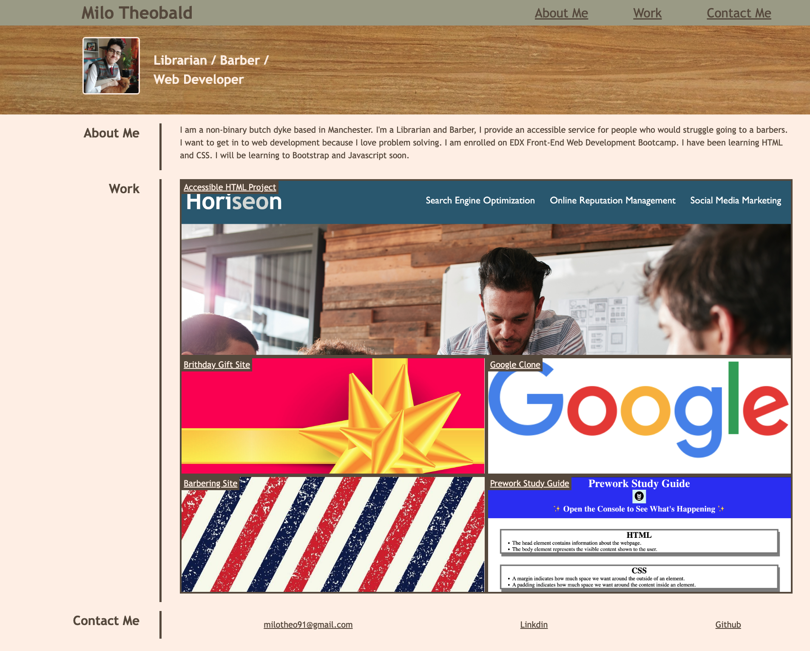
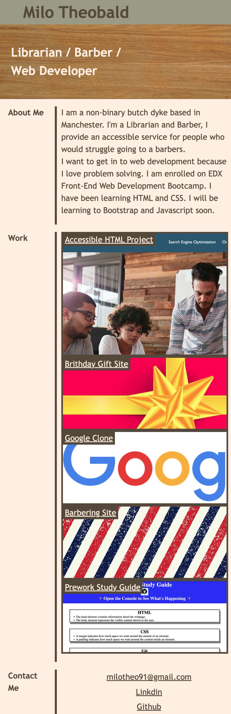

# Milo-Portfolio
https://liquidgarbage.github.io/Milo-portfolio/

- [Description](#description)
- [Usage](#usage)
- [Credits](#credits)
- [License](#license)

## Description

This page is a portfolio of my web development work, it is an on-going project. As I learn more the site will have more content. 

I built it to provide a portfolio of my work to potential employers. 
I also built it for myself. I am proud of the things I have made so far. I am excited to see things become more complex as I learn more. 

I solved problems such as:
- Grid and flexbox allignment, in earlier versions I struggled to get the layout to display correctly. 
- Media queries stacking grid elements incorrectly
- Github not linking to the CSS and image files

I learnt:
- How to build a site from scratch
- How to use grid and flexbox in the CSS. 
- How to use media queries

## Installation
N/A

## Usage
To be used as a portfolio to show work to others

Desktop View
    

Mobile View
    

## Credits

[Scrimba HTML and CSS course for the Gift and Google clone sites](https://scrimba.com/learn/htmlandcss)

[W3 media query guidance](https://www.w3schools.com/cssref/css3_pr_mediaquery.php)

## Licence
Please refer to the LICENSE in the repo.